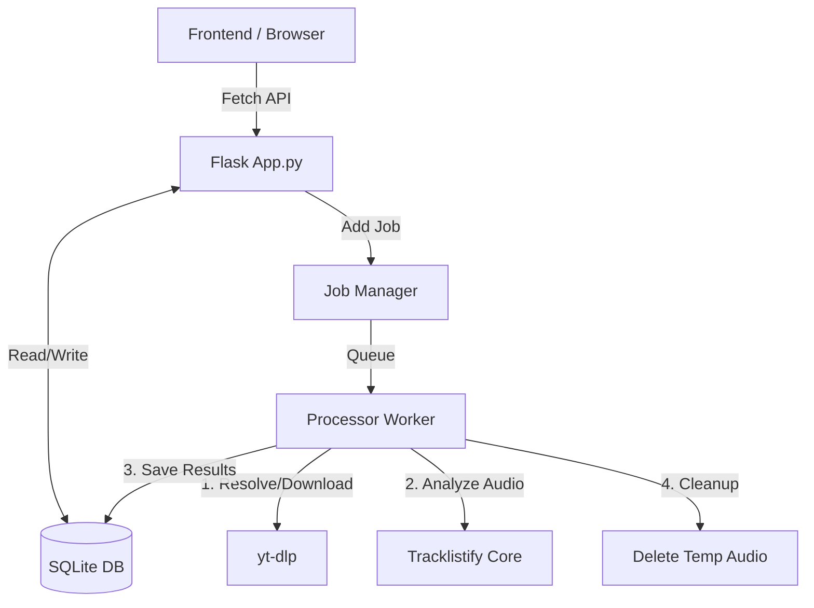

# Tracklistify Studio (Helper Edition)


**Tracklistify Studio** ist eine lokale Hybrid-Webanwendung für DJs und Musiksammler. Sie automatisiert die Analyse von DJ-Sets, erkennt Tracks (via Audio-Fingerprinting), verwaltet Metadaten und hilft beim Aufbau einer kuratierten Musikbibliothek ("Merkliste").

> [!NOTE]
> **Datenschutz:** Die Analyse läuft komplett lokal auf deinem Rechner. Deine Audio-Dateien und Datenbank verlassen deinen PC nicht.

---

## 🚀 Features

* **Smart Import & Analyse:**
    * Importiere Sets direkt via **YouTube/Mixcloud URL** oder lokale Audiodateien.
    * **Auto-Tagging:** Automatische Erkennung von Artist, Event und Set-Name aus Dateinamen oder Videotiteln (Smart Regex Parsing).
    * Hintergrund-Verarbeitung in einer **Warteschlange (Queue)** – arbeite weiter, während analysiert wird.
* **Audio Player & Preloading:**
    * **Instant Playback:** Streaming-URLs werden im Hintergrund vorgeladen (Aggressive Preloading), sodass Tracks ohne Verzögerung starten.
    * **Midas Touch Scrubbing:** Optimierter Player für einfache Navigation im Set.
    * **Visuelles Feedback:** Deterministische Waveform-Visualisierung auf Canvas-Basis.
* **Set Management:**
    * Metadaten-Editor für Sets (B2B, Event, Tags).
    * **Dashboard:** Statistiken zu deinen Top-Artists und Discovery-Raten.
    * Rechtsklick-Kontextmenüs für schnelle Aktionen.
* **Track Discovery:**
    * "Merkliste" (Likes) Funktion mit eigenem Shopping-View.
    * Direkte Shop-Links zu **Bandcamp** (Primary), Beatport, SoundCloud und YouTube.
    * **Rescan-Queue:** Markiere falsch erkannte Tracks zur späteren Überprüfung.

---

## 🛠️ Architektur



---

## 📦 Installation

### 1. Voraussetzungen
* **Python 3.10+**
* **FFmpeg:** Muss im System-PATH installiert sein (für Audio-Konvertierung).

### 2. Setup

## Running the app
```bash
# Repository klonen
git clone [https://github.com/DEIN_USER/tracklistify-studio.git](https://github.com/DEIN_USER/tracklistify-studio.git)
cd tracklistify-studio

# Virtuelle Umgebung erstellen (Windows)
python -m venv .venv
.venv\Scripts\activate

# Abhängigkeiten installieren
pip install -r requirements.txt
# Falls requirements.txt fehlt:
pip install flask yt-dlp tracklistify
 
# Hinweis: Es sind keine optionalen Bibliotheken wie "ktem" nötig – alle erforderlichen
# Pakete sind bereits in der requirements.txt hinterlegt, damit die Installation sofort
# funktioniert.
```
The server initializes the database, kicks off the background job worker, imports any JSON already present in `.tracklistify/output`, and serves the UI at `http://127.0.0.1:5000`.

---

## ▶️ Starten

### Windows (One-Click)
Starte die Datei **`start_helper.bat`**.

### Manuell (Terminal)
```bash
python app.py
```
Der Server startet standardmäßig auf `http://127.0.0.1:5000`.

---

## 📂 Projektstruktur

```text
tracklistify/
├── app.py                 # Flask Controller & API Routes
├── job_manager.py         # Threaded Queue Management
├── database.py            # SQLite Model & Queries
├── config.py              # Pfad-Konfigurationen
├── services/
│   ├── processor.py       # Worker: Download, Analyse, Cleanup
│   └── importer.py        # Importiert JSON-Ergebnisse
├── static/
│   ├── js/app.js          # Frontend Logik (Alpine.js)
│   └── tracklistify_logo.png
└── templates/             # Jinja2 Views
    ├── base.html          # Base Layout (Tailwind Load)
    ├── index.html         # Main Layout Container
    └── components/        # Modulare UI-Teile
        ├── dashboard.html
        ├── footer_player.html
        ├── queue_view.html
        ├── rescan_view.html
        └── ...
```

---

## 🗺️ Roadmap

- [x] Audio Player mit Waveform-Visualisierung (Canvas)
- [x] Warteschlange (Queue) System mit Status-Pill
- [x] Smart Metadata Parsing (Regex für Uploads)
- [x] Dashboard & Statistiken
- [ ] **Spotify Export:** Erstelle Playlists direkt aus deinen Likes.
- [ ] **Artist Database:** Detaillierte Profile & Social Links für gefundene Künstler.
- [ ] **Drag & Drop:** Einfacheres Hinzufügen von Dateien im Browser.

---

## ⚠️ Disclaimer

> [!WARNING]
> **Rechtlicher Hinweis:** Dieses Tool nutzt `yt-dlp` zum Streamen und Analysieren von Audio. Bitte beachte die Urheberrechte und Nutzungsbedingungen der jeweiligen Plattformen (YouTube, Mixcloud, etc.). Die heruntergeladenen Dateien werden nach der Analyse automatisch gelöscht (Hybrid-Ansatz), um Speicherplatz zu sparen und lokale Kopien zu minimieren.
